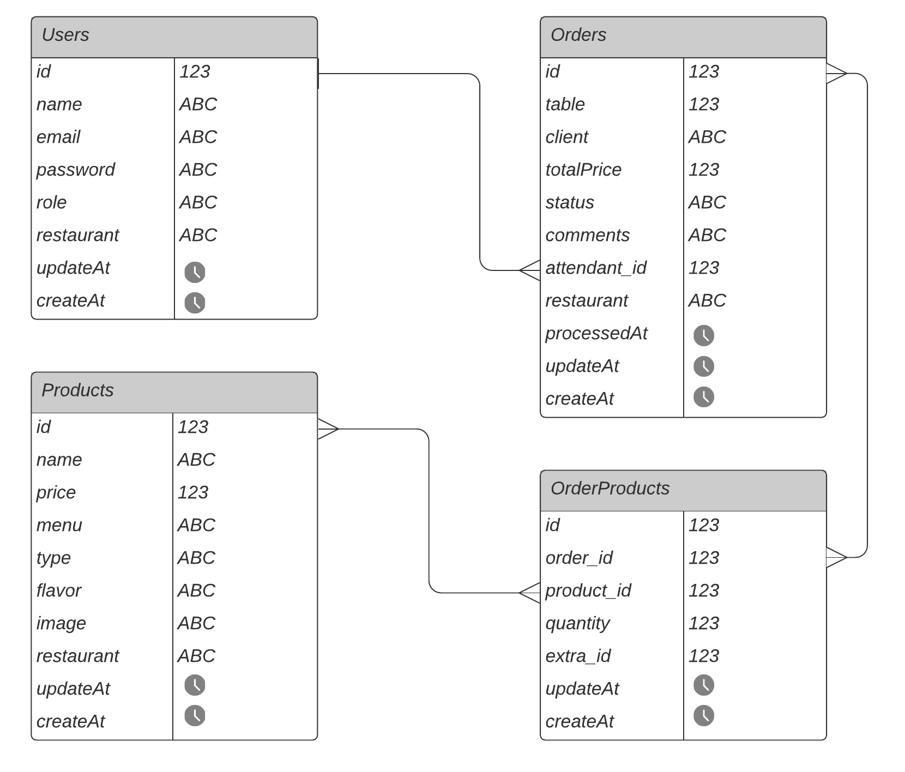

    </img>

    🌟 An API REST to create and save users, products and orders in a database. To access click <a href='https://burgerlicious-api.herokuapp.com/'>here</a>! 🌟 

    
    

 <a href="#challenge">Challenge</a> •
 <a href="#about">About</a> •
 <a href="#processo-de-criação">Development</a> • 
 <a href="#build-with">Build With</a> • 
 <a href="#acknowledgments-and-credits">Acknowledgments and credits</a> • 
 <a href="#author">Author</a>

---

## 💪 Challenge

Create a web server through a rest API with integration to a relational database, providing CRUD manipulation methods and following the Model View Controller (MVC) architecture model, using the stack: [Node.js](https://nodejs.org/), [Express](https://expressjs.com/), [Sequelize](https://sequelize.org) and [PostgreSQL](https://www.postgresql.org/docs/). 

    </img>

---

## 🍔 About

A small, fast-growing burger restaurant needs a system to place orders using a tablet, and to send them to the kitchen so they can be prepared in an orderly and efficient manner. A front-end interface for the [Burgerlicious](https://burgerlicious-git-main-cbalieiro.vercel.app/) application has already been created, and now we need to create the back-end to handle the data. The Burgerlicious API was developed to attend to the front-end requests, responding with JSON through an HTTP connection.

---

## 💻 Development

### ⚙️ Endpoints

This API  offers an user endpoint, so then the restaurant employees can register in the system and update their personal info. There is also a product endpoint, which allows the register of menu products and also keep their data updated. The orders endpoints also have these functionalities and them all allow the user to get and delete a database item or get all items castrated. You can check which information you can save in the database on the ER diagram below. 

#### 👨‍🍳 `/users`

* [ ] `GET /users`
* [ ] `GET /users/:uid`
* [ ] `POST /users`
* [ ] `PUT /users/:uid`
* [ ] `DELETE /users/:uid`

#### 🍟 `/products`

* [ ] `GET /products`
* [ ] `GET /products/:productid`
* [ ] `POST /products`
* [ ] `PUT /products/:productid`
* [ ] `DELETE /products/:productid`

#### 📋 `/orders`

* [ ] `GET /orders`
* [ ] `GET /orders/:orderid`
* [ ] `POST /orders`
* [ ] `PUT /orders/:orderid`
* [ ] `DELETE /orders/:orderid`

### 📂 Database

For this system three basic models were created, users, products and orders. However, as the products table and orders table have a many-to-many relationship it was necessary to create a fourth table, order products, so we can list all products that were chosen for an order. 

    </img>

### 🚧 Future implementations

&nbsp;
📌 Auth endpoint

&nbsp;
📌 Clients endpoint 

---

## 🛠 Build With

&nbsp;
👉 JavaScript (ES6)

&nbsp;
👉 [Node.js](https://nodejs.org/)

&nbsp;
👉 [Express](https://expressjs.com/)

&nbsp;
👉 [Sequelize](https://sequelize.org)

&nbsp;
👉 [PostgreSQL](https://www.postgresql.org/docs/)

---

## 👩‍💻 Acknowledgments and credits

&nbsp;
Project developed in [Laboratoria](https://www.laboratoria.la/) Bootcamp 💛

---

## 🦸 Author

&nbsp;
Developed with ❤️ by [Beatriz Penalva](https://github.com/beatrizpenalva) 👋
